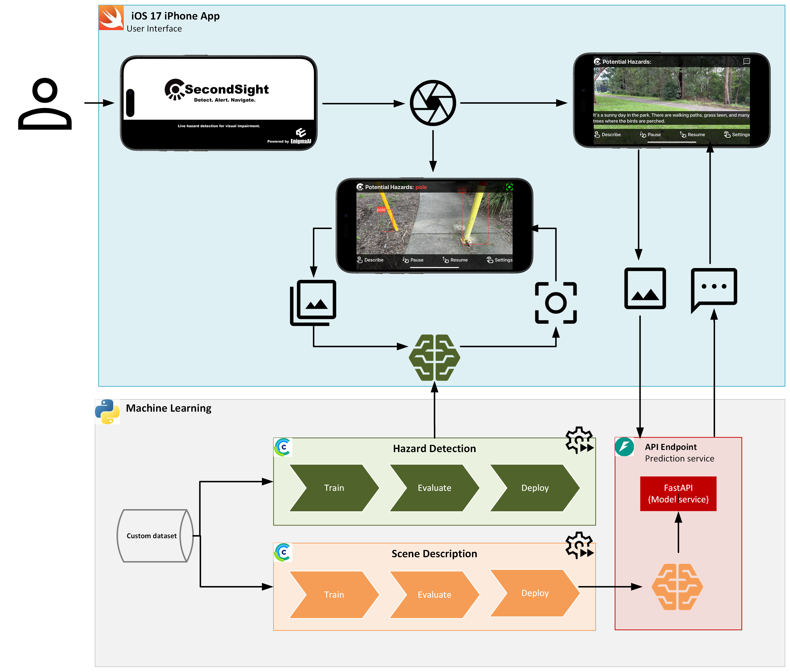
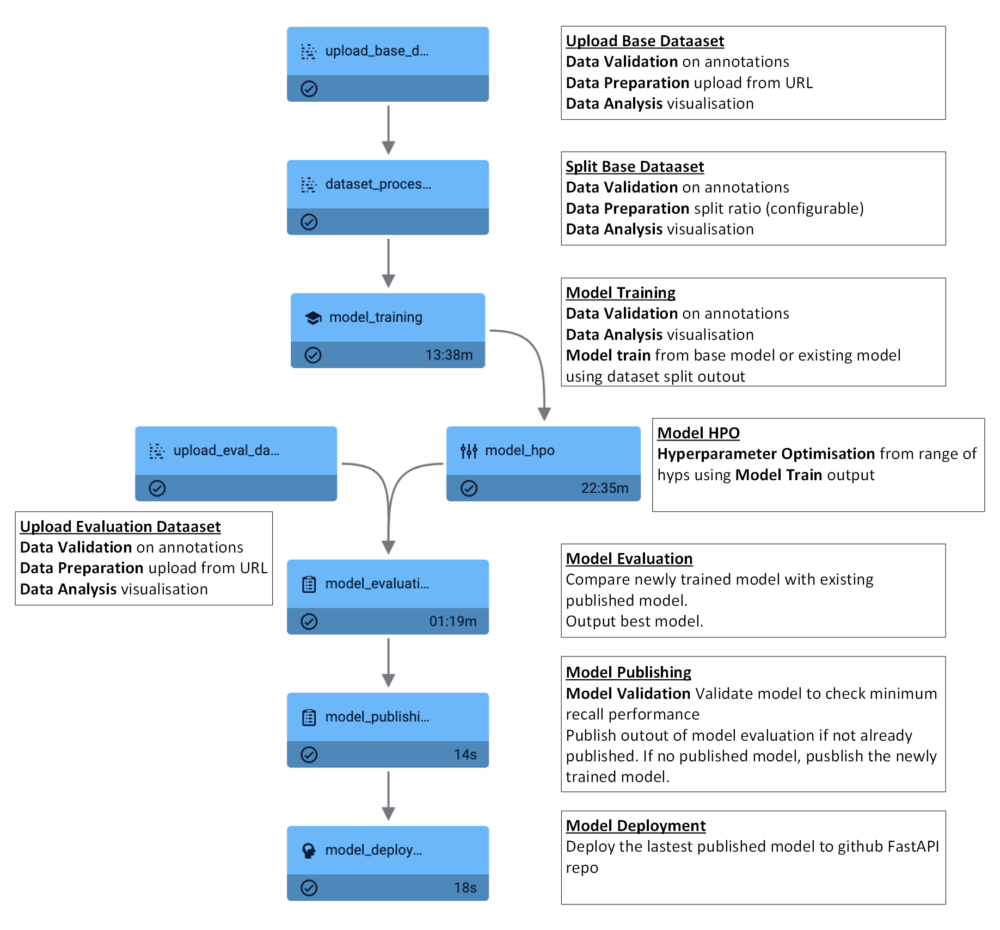
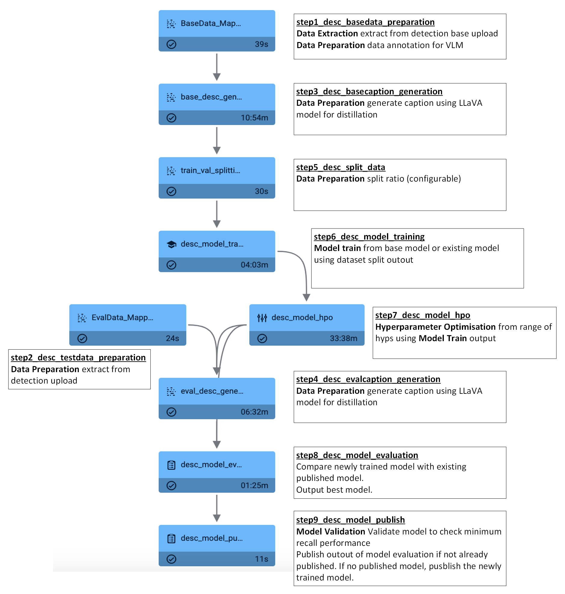

# SecondSight MLOps

**ML Pipeline Automation for Hazard Detection & Scene Description**

This repository contains the **MLOps infrastructure** for SecondSight - an AI-powered assistive iOS application for individuals with visual impairment. The project implements end-to-end machine learning pipelines for training, evaluating, and deploying two core AI models: **YOLO v11n** for hazard detection and **distilled VLM** for scene description.

## Project Context

SecondSight provides real-time hazard detection and environmental scene description through:
- **On-device inference**: YOLO v11n CoreML model for hazard detection (5 classes: pole, vehicle, person, wheelchair, stroller)
- **Remote inference**: LLaVA 1.5-7B distilled model for scene description via FastAPI
- **Target platform**: iOS 17+ (iPhone 14 Pro / 15 Pro)
- **Performance targets**: ≥75% recall for detection, ≥0.47 CIDER for description, ≤300ms latency

---

## Table of Contents
- [MLOps Architecture](#mlops-architecture)
- [Pipeline Overview](#pipeline-overview)
  - [Hazard Detection Pipeline](#hazard-detection-pipeline)
  - [Scene Description Pipeline](#scene-description-pipeline)
- [Pipeline Orchestration](#pipeline-orchestration)
- [Model Training & Deployment](#model-training--deployment)
- [Performance Monitoring](#performance-monitoring)
- [Environment Setup](#environment-setup)
- [Running Pipelines](#running-pipelines)
- [Project Structure](#project-structure)
- [CI/CD Workflow](#cicd-workflow)

---

## System Architecture Design

The system architecture implements **component-based design** with automated pipelines for continuous model training, evaluation, and deployment.



For application component, please see [SecondSight](https://github.com/mlstudios-ai/SecondSight)

For API component, please see [FastAPI API](https://github.com/mlstudios-ai/SecondSight-API)

### MLOps Stack:

#### **Orchestration & Experimentation**
- **ClearML**: Pipeline orchestration, experiment tracking, model versioning
- **Remote Agents**: Google Cloud compute for distributed task execution
- **Task Scheduling**: Automated pipeline triggers and dependencies

#### **Model Training**
- **Hazard Detection**: YOLO v11n training on custom hazard dataset (5 classes)
- **Scene Description**: Knowledge distillation from LLaVA 1.5-7B to lightweight VIT-GPT2 student model
- **HPO**: Hyperparameter optimization using ClearML orchestrated experiments and pipelines

#### **Model Deployment**
- **On-device (iOS)**: PyTorch → CoreML conversion for hazard detection
- **Remote API**: FastAPI endpoint for scene description inference
- **Containerization**: Docker images deployed to AWS ECS
- **CI/CD**: GitHub Actions for automated model deployment

#### **Model Serving**
- **FastAPI**: REST API for model inference (both on-device and remote endpoints via nprok tunneling)
- **GitHub Repo**: Model artifacts published to GitHub for version control

---

## Pipeline Overview

### Hazard Detection Pipeline

Automated end-to-end pipeline for training and deploying **YOLO v11n Nano CoreML** models for on-device hazard detection (5 classes: pole, vehicle, person, wheelchair, stroller).



#### **Key Features**
- **Automation**: Sequential ClearML tasks with dependency management
- **Remote Execution**: Tasks distributed across Google Cloud remote agents
- **Version Control**: All models tracked in ClearML registry with metrics
- **Validation Gates**: Publishing only if recall threshold (≥75%) is met
- **Model Format**: PyTorch → CoreML conversion for iOS deployment

#### **Configuration**
```python
# Pipeline orchestration via ClearML
pipeline = Pipeline(name="hazard_detection_pipeline")
pipeline.add_step(name="upload_base_dataset", ...)
pipeline.add_step(name="model_training", parents=["upload_base_dataset"], ...)
pipeline.start_remotely(queue="default")
```

---

### Scene Description Pipeline

Automated MLOps pipeline for **knowledge distillation** from LLaVA 1.5-7B teacher model to lightweight VIT-GPT2 student model for scene description generation.



#### **Knowledge Distillation Strategy**
- **Teacher Model**: LLaVA 1.5-7B (vision-language model) - high quality but computationally expensive
- **Student Model**: VIT-GPT2 (distilled) - lightweight for real-time inference
- **Distillation Process**: Student learns from teacher-generated captions, not direct mimicking
- **Benefits**: 10x faster inference, much smaller model size, maintains quality (CIDER ≥0.47)

#### **Evaluation Metrics**
- **CIDER**: Consensus-based Image Description Evaluation (primary metric, target ≥0.47)
- **BLEU**: N-gram precision for caption quality
- **ROUGE**: Recall-based evaluation for description completeness

#### **Deployment**
```python
# FastAPI inference endpoint
@app.post("/describe")
async def generate_description(image: UploadFile):
    # Load distilled VIT-GPT2 model
    # Generate description
    # Return JSON response
```

---

## Pipeline Orchestration

### ClearML Task Execution

All pipeline tasks are orchestrated using **ClearML** with remote agent execution on Google Cloud:

```python
# Example: Hazard Detection Pipeline Orchestration
from clearml import Pipeline

pipe = Pipeline(
    name="hazard_detection_pipeline",
    project="SecondSight/HazardDetection",
    version="1.0"
)

# Define tasks with dependencies
pipe.add_step(
    name="upload_base_dataset",
    base_task_project="SecondSight/Tasks",
    base_task_name="dataset_upload",
    parameter_override={"dataset_url": "${pipeline.dataset_url}"}
)

pipe.add_step(
    name="model_training",
    parents=["upload_base_dataset", "dataset_process_split"],
    base_task_project="SecondSight/Tasks",
    base_task_name="yolo_training",
    parameter_override={"epochs": 100, "batch_size": 16}
)

# Start pipeline on remote queue
pipe.start_remotely(queue="default")
```

### Task Configuration
- **Agents**: Google Cloud remote agents with GPU support
- **Queues**: Default queue for CPU tasks, GPU queue for training tasks
- **Caching**: Intermediate results cached in ClearML for reproducibility
- **Logging**: All metrics, artifacts, and logs tracked in ClearML UI

---

## Model Training & Deployment

### Hazard Detection Workflow

```bash
# 1. Dataset preparation
python hazard_detection/pipelines/tasks/dataset_base_upload.py
python hazard_detection/pipelines/tasks/dataset_base_split.py

# 2. Model training
python hazard_detection/pipelines/tasks/model_train.py \
  --epochs 100 --batch_size 16 --img_size 640

# 3. Hyperparameter optimization
python hazard_detection/pipelines/tasks/model_hpo.py \
  --param_ranges '{"lr": [0.001, 0.01], "batch_size": [8, 16, 32]}'

# 4. Model evaluation
python hazard_detection/pipelines/tasks/model_eval.py \
  --test_dataset <dataset_id> --model_id <trained_model_id>

# 5. Publishing (if recall ≥ 75%)
python hazard_detection/pipelines/tasks/model_publish.py \
  --model_id <best_model_id> --min_recall 0.75

# 6. Deployment to FastAPI
python hazard_detection/pipelines/tasks/model_deploy.py \
  --model_id <published_model_id> --deploy_target github
```

### Scene Description Workflow

```bash
# 1. Data extraction from hazard detection dataset
python image_description/pipelines/tasks/base_data_preparation.py

# 2. Teacher model caption generation (LLaVA 1.5-7B)
python image_description/pipelines/tasks/base_desc_generation.py \
  --teacher_model "llava-1.5-7b" --batch_size 8

# 3. Student model training (knowledge distillation)
python image_description/pipelines/tasks/desc_model_train.py \
  --student_model "vit-gpt2" --epochs 50 --learning_rate 5e-5

# 4. HPO for student model
python image_description/pipelines/tasks/desc_hpo.py

# 5. Evaluation (CIDER, BLEU, ROUGE)
python image_description/pipelines/tasks/desc_model_eval.py

# 6. Publishing (if CIDER ≥ 0.47)
python image_description/pipelines/tasks/desc_model_publish.py \
  --min_cider 0.47
```

### Model Registry
- **ClearML Model Registry**: All trained models tracked with metadata
- **Versioning**: Semantic versioning (v1.0, v1.1, v2.0)
- **Tagging**: Models tagged as `baseline`, `candidate`, `production`
- **Artifacts**: Model weights, config files, performance metrics stored

---

## Performance Monitoring

### Model Performance Metrics

#### Hazard Detection (YOLO v11n)
| Metric | Target | Achieved | Pipeline Task |
|--------|--------|----------|---------------|
| **Recall (Macro)** | ≥75% | **75.1%** | `model_evaluation` |
| **mAP50** | ≥80% | **0.817** | `model_evaluation` |
| **FPS (On-device)** | ≥15 FPS | **≥20 FPS** | Post-deployment validation |
| **Inference Latency** | ≤300ms | **~35ms** | `model_deploy` |
| **Model Size** | <50MB | **~25MB** | CoreML conversion |

#### Scene Description (Distilled VLM)
| Metric | Target | Achieved | Pipeline Task |
|--------|--------|----------|---------------|
| **CIDER Score** | ≥0.47 | **0.4686** | `desc_model_evaluation` |
| **BLEU-4** | - | Logged | `desc_model_evaluation` |
| **ROUGE-L** | - | Logged | `desc_model_evaluation` |
| **Inference Time** | <1s | Logged | FastAPI endpoint |
| **Caption Length** | <10 words | ✓ | Post-processing validation |

### Experiment Tracking
- **ClearML Dashboard**: Real-time metrics, loss curves, sample predictions
- **Hyperparameter Logging**: All hyperparameters logged per experiment
- **Model Comparison**: Side-by-side comparison of model versions
- **Artifact Storage**: Model checkpoints, training logs, evaluation reports

---

## Environment Setup

### Prerequisites
- **Python**: 3.8+ (recommended: 3.9 or 3.10)
- **ClearML Account**: Sign up at [clear.ml](https://clear.ml) for pipeline orchestration
- **Google Cloud** (optional): For remote agent execution
- **Git**: Version control

### Installation

1. **Clone the repository**
   ```bash
   git clone https://github.com/your-repo/SecondSight-MLOps.git
   cd SecondSight-MLOps
   ```

2. **Create virtual environment**
   ```bash
   python -m venv venv
   source venv/bin/activate  # On Windows: venv\Scripts\activate
   ```

3. **Install dependencies**
   ```bash
   # Top-level dependencies
   pip install -r requirements.txt
   
   # Hazard Detection pipeline dependencies
   pip install -r hazard_detection/requirements.txt
   
   # Scene Description pipeline dependencies
   pip install -r image_description/requirements.txt
   ```

4. **Configure ClearML**
   ```bash
   clearml-init
   # Follow prompts to enter API credentials from clear.ml
   ```

5. **Set up environment variables**
   ```bash
   cp .env.example .env
   # Edit .env with your configuration
   ```

---

## Running Pipelines

### Option 1: Via ClearML UI
1. Navigate to ClearML web UI
2. Go to Pipelines → Create New Pipeline
3. Select `hazard_detection_pipeline` or `scene_description_pipeline`
4. Configure parameters and start execution

### Option 2: Via Python SDK

**Run Hazard Detection Pipeline:**
```bash
cd hazard_detection/pipelines
python detection_pipeline.py \
  --dataset_url "https://path/to/dataset.zip" \
  --epochs 100 \
  --batch_size 16 \
  --queue "default"
```

**Run Scene Description Pipeline:**
```bash
cd image_description/pipelines
python desc_pipeline.py \
  --teacher_model "llava-1.5-7b" \
  --student_model "vit-gpt2" \
  --queue "default"
```

### Option 3: Individual Task Execution

```bash
# Run individual pipeline task
cd hazard_detection/pipelines/tasks
python model_train.py --config configs/train_config.yaml
```

### Remote Agent Setup (Google Cloud)

```bash
# On Google Cloud VM with GPU
pip install clearml-agent
clearml-agent init
clearml-agent daemon --queue default --gpu
```

---

## Project Structure

```
SecondSight-MLOps/
├── .github/
│   └── workflows/                       # GitHub Actions CI/CD
│       ├── deploy_detection.yml         # Auto-deploy hazard detection model
│       └── deploy_description.yml       # Auto-deploy scene description model
├── docs/
│   └── images/                          # Architecture diagrams
├── hazard_detection/                    # Hazard Detection MLOps
│   ├── pipelines/
│   │   ├── detection_pipeline.py        # Main pipeline orchestration
│   │   ├── tasks/                       # ClearML pipeline tasks
│   │   │   ├── dataset_base_upload.py
│   │   │   ├── dataset_base_split.py
│   │   │   ├── model_train.py
│   │   │   ├── model_hpo.py
│   │   │   ├── model_eval.py
│   │   │   ├── model_publish.py
│   │   │   └── model_deploy.py
│   │   └── triggers/                    # Pipeline trigger configurations
│   ├── configs/                         # Training configurations
│   ├── requirements.txt
│   └── README.md
├── image_description/                   # Scene Description MLOps
│   ├── pipelines/
│   │   ├── desc_pipeline.py             # Main pipeline orchestration
│   │   ├── tasks/                       # ClearML pipeline tasks
│   │   │   ├── base_data_preparation.py
│   │   │   ├── base_desc_generation.py
│   │   │   ├── desc_data_split.py
│   │   │   ├── desc_model_train.py
│   │   │   ├── desc_hpo.py
│   │   │   ├── desc_model_eval.py
│   │   │   └── desc_model_publish.py
│   │   └── triggers/
│   ├── model_api_inferencing.py         # FastAPI inference server
│   ├── requirements.txt
│   └── README.md
├── notebooks/                           # Exploratory notebooks & POC
│   ├── data_exploration.py
│   └── model_experiments.ipynb
├── .env                                 # Environment variables (git-ignored)
├── .gitignore
├── requirements.txt                     # Core dependencies
├── setup.py                             # Package setup
└── README.md                            # This file
```

### Key Directories

- **`hazard_detection/pipelines/tasks/`**: Individual ClearML tasks for detection pipeline
- **`image_description/pipelines/tasks/`**: Individual ClearML tasks for description pipeline
- **`.github/workflows/`**: CI/CD automation for model deployment
- **`configs/`**: Training configurations, hyperparameter ranges

For more details on each component:
- **Hazard Detection Pipeline**: [hazard_detection/README.md](hazard_detection/README.md)
- **Scene Description Pipeline**: [image_description/README.md](image_description/README.md)

---

## CI/CD Workflow

### GitHub Actions Integration
- **Pipeline Re-run** on PR sumbission for code changes

### Continuous Integration
- **Linting**: `flake8`, `black` for code formatting
- **Testing**: Unit tests for pipeline tasks
- **Model Validation**: Automated evaluation on test set
- **Registry Checks**: Verify model meets performance thresholds before deployment

---

## Technology Stack

### MLOps & Orchestration
- **ClearML**: Experiment tracking, pipeline orchestration, model registry
- **Google Cloud**: Remote compute agents for distributed training
- **GitHub Actions**: CI/CD automation

### ML Frameworks
- **PyTorch**: Model training (YOLO v11n, VIT-GPT2)
- **Ultralytics YOLO**: Object detection framework
- **Transformers (HuggingFace)**: Vision-language models
- **CoreML Tools**: iOS model conversion

### Deployment & Serving
- **FastAPI**: REST API for model inference
- **Docker**: Containerization

### Monitoring & Logging
- **ClearML**: Experiment tracking, metrics logging


