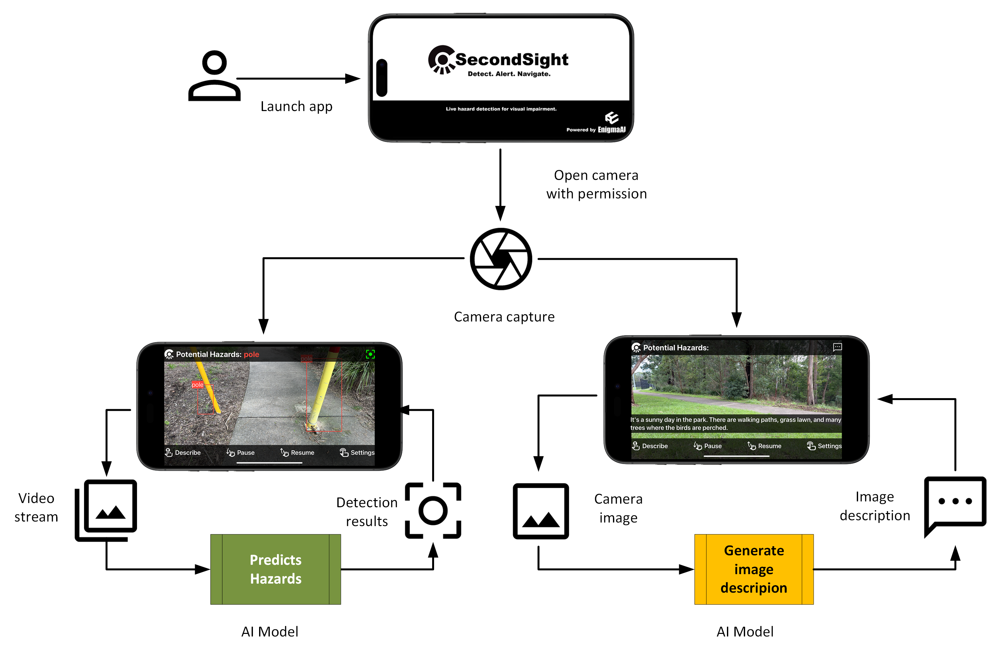

# SecondSight by EnigmaAI

**Detect. Alert. Navigate.**

SecondSight is an AI-powered assistive iOS application designed for individuals with visual impairment using state-of-the-art artificial intelligence technology. The application performs hazard object detection to prevent accidents as well as hazard and environmental description to provide additional support choices focusing on safety and spatial awareness in the environment.

> **Note:** This application is not designed to replace existing and scientifically proven methods and tools but as a complementary assistive tool to address the gaps of visual challenges.

---

## Table of Contents
- [Objectives](#objectives)
- [Features and Modes](#features-and-modes)
- [System Architecture](#system-architecture)
- [User Data Flow](#user-data-flow)
- [ML Components](#ml-components)
  - [Hazard Detection Pipeline](#hazard-detection-pipeline)
  - [Scene Description Pipeline](#scene-description-pipeline)
- [Technical Requirements](#technical-requirements)
- [Performance Metrics](#performance-metrics)
- [Environment Setup](#environment-setup)
- [Project Structure](#project-structure)
- [Team](#team)

---

## Objectives

As technology advances in artificial intelligence (AI), we explore new and innovative ways to bridge the gaps in special needs for visual impairment to enable independence and improve overall quality of life. Our long-term objectives are:

1. **Accident prevention and safety improvement**
2. **Awareness of surroundings and peace of mind**
3. **Relieve economic burden on welfare system**
4. **Improve accessibility socially, economically and geographically**

Our ultimate goal is to improve the quality of life for as many people as possible, especially where support facility is unattainable due to availability, financial or geographical challenges.

---

## Features and Modes

SecondSight provides two operational modes to cater to different user needs:

### 1. Standalone Mode
- **Hazard object detection** with haptic feedback
- Real-time continuous detection on live camera video
- Minimal battery consumption (no speech description)
- Works offline (no internet connection required)
- Ideal for quick navigation tasks

### 2. Plus Mode
- All features from Standalone mode
- **Scene description** upon hazard detection or on-demand via two-finger tap
- Speech feedback for both hazard alerts and environmental descriptions
- Requires internet connection for remote scene description API
- Provides comprehensive situational awareness

### User Interactions
The application is designed with accessibility in mind, featuring:
- **Zero interaction to start**: Single screen launches detection automatically
- **Two-finger tap**: Request scene description (requires internet connection)
- **Swipe down**: Pause detection
- **Swipe up**: Resume detection
- **Gesture-based controls**: Simple, accessible interface catering for blindness, physical disability, and cognitive impairment

---

## System Architecture

The system uses component-based design to allow future upgrade and integration for interoperability. The system is divided into 3 key components:

1. **User Interface** (iOS UI application functionality)
2. **Model Inferencing** (on-device and remote)
3. **Machine Learning Pipelines** (Hazard Detection and Scene Description)


### Key Components:
- **iOS 17 iPhone App**: SwiftUI-based user interface with gesture controls
- **Video Handler**: Manages video stream capture and processing
- **Hazard Detection**: YOLOv11n CoreML model for on-device inference
- **Scene Description**: LLaVA 1.5-7B model via FastAPI remote inference
- **REST API**: FastAPI endpoints for model inference (remote/device)
- **ClearML Pipelines**: Automated ML pipelines for model training and deployment
- **GitHub Actions**: CI/CD for continuous deployment
- **Docker & AWS ECS**: Containerized deployment infrastructure

---

## User Data Flow

SecondSight processes user interactions through a streamlined data flow:



1. **User launches app** → Opens camera with permission
2. **Camera capture** → Continuous video stream processing
3. **Video stream** → Fed to hazard detection AI model
4. **Detection results** → Displayed with bounding boxes, haptic feedback, and speech alerts
5. **Scene description** (on-demand) → Camera image sent to description AI model
6. **Image description** → Generated text spoken to user

**Privacy Note:** The application does not collect or store any user data. Video processing is performed in real-time without saving images.

---

## ML Components

### Hazard Detection Pipeline

The hazard detection component uses **YOLO v11n Nano CoreML** model for on-device object detection and hazard identification.

**Detected Hazard Classes (5 classes):**
- Pole
- Vehicle
- Person
- Wheelchair
- Stroller


**Pipeline Stages:**
1. **Upload Base Dataset**: Data validation on annotations, upload from URL, visualization
2. **Split Base Dataset**: Configurable split ratio with data preparation
3. **Model Training**: Train from base model or existing model (13:38m runtime)
4. **Model HPO**: Hyperparameter optimization from range of hyperparameters (22:35m runtime)
5. **Model Evaluation**: Compare newly trained model with existing published model (01:19m runtime)
6. **Model Publishing**: Validate minimum recall performance, publish best model (14s runtime)
7. **Model Deployment**: Deploy the latest published model to GitHub FastAPI repo (18s runtime)

**Technologies:**
- **Framework**: YOLO v11n (You Only Look Once)
- **Automation**: ClearML orchestrated pipeline using Google Cloud as remote agent
- **Deployment**: CoreML model embedded in iOS app for on-device inference

---

### Scene Description Pipeline

The scene description component uses **LLaVA 1.5-7B** (distilled VIT-GPT2 student model) for generating concise, relevant scene descriptions.


**Pipeline Stages:**
1. **Base Data Preparation**: Extract data from Hazard Detection base upload, data annotation for VLM (39s runtime)
2. **Test Data Preparation**: Extract from detection upload
3. **Base Caption Generation**: Generate captions using LLaVA model for distillation (10:54m runtime)
4. **Eval Caption Generation**: Generate captions using LLaVA model for distillation (06:32m runtime)
5. **Split Data**: Configurable split ratio (30s runtime)
6. **Model Training**: Train from base model or existing model using dataset split output (04:03m runtime)
7. **Model HPO**: Hyperparameter optimization from range of hyperparameters (33:38m runtime)
8. **Model Evaluation**: Compare newly trained model with existing published model (01:25m runtime)
9. **Model Publishing**: Validate model to check minimum recall performance, publish best model (11s runtime)

**Technologies:**
- **Base Model**: LLaVA 1.5-7B for caption generation
- **Student Model**: Distilled VIT-GPT2 (lightweight for mobile inference)
- **Automation**: ClearML orchestrated pipeline using Google Cloud as remote agent
- **Deployment**: FastAPI remote inference endpoint (model hosted on server)
- **Evaluation Metric**: CIDER (Consensus-based Image Description Evaluation)

---

## Technical Requirements

### Device Requirements
- **Device**: iPhone 14 Pro / 15 Pro or later
- **OS**: iOS 17+
- **RAM**: 8GB RAM minimum
- **Processor**: Neural engine and GPU capability (iPhone 15 Pro Max recommended)

### System Requirements
- **Camera**: Device camera with suitable specifications for object detection
- **Camera Angle**: Point to the ground covering 2-3 stride distance
- **Detection Latency**: Within 2 seconds or 2-3 strides to allow time for reaction
- **End-to-end Latency**: ≤300ms for real-time hazard detection
- **Remote API Latency**: ≤300ms under normal network conditions
- **Battery Efficiency**: Consume no more than 10% battery per hour of active use
- **Frame Rate**: Minimum 15 frames per second on-device

### Usage Environment
- **Designed for**: Outdoor daytime use with good sunlight
- **Not suitable for**: Low light or extremely hazardous and dangerous environments

---

## Performance Metrics

### Hazard Detection (YOLO v11n)
| Metric | Target | Achieved | Notes |
|--------|--------|----------|-------|
| **Recall** | ≥75% | **75.1%** | Macro recall on held-out test set (+6 pp improvement) |
| **mAP50** | ≥80% | **0.817** | Mean Average Precision at IoU 0.5 (up from 0.733) |
| **FPS** | ≥15 FPS | **≥20 FPS** | On-device CoreML proto renders 21 FPS (100 layers, 6.3 GFLOPs) |
| **Latency** | ≤300ms | **~35ms** | A100 + ~35ms on-device measured at 2.8ms on A100 |

### Scene Description (Distilled VLM)
| Metric | Target | Achieved | Notes |
|--------|--------|----------|-------|
| **CIDER Score** | ≥0.50 | **≥0.47** | Baseline target of 0.50 in v4.0; best student model reached 0.4686 after HPO (stretch goal of 0.50) |
| **Quality** | Relevant & concise | ✓ | Clear and quantifiable descriptions averaging under 10 words per caption |

---

## Environment Setup

### Prerequisites
- Python 3.8+
- pip package manager
- Git

### Installation

1. **Clone the repository**
   ```bash
   git clone https://github.com/your-repo/SecondSight-MLOps.git
   cd SecondSight-MLOps
   ```

2. **Install top-level dependencies**
   ```bash
   pip install -r requirements.txt
   ```

3. **Install Hazard Detection dependencies**
   ```bash
   cd hazard_detection
   pip install -r requirements.txt
   cd ..
   ```

4. **Install Image Description dependencies**
   ```bash
   cd image_description
   pip install -r requirements.txt
   cd ..
   ```

---

## Project Structure

```
SecondSight-MLOps/
├── docs/
│   └── images/                          # Documentation diagrams
├── hazard_detection/                    # YOLO hazard detection module
│   ├── pipelines/                       # ClearML pipeline automation
│   │   └── tasks/                       # Individual pipeline tasks
│   ├── requirements.txt
│   └── README.md
├── image_description/                   # VLM scene description module
│   ├── pipelines/                       # ClearML pipeline automation
│   │   └── tasks/                       # Individual pipeline tasks
│   ├── model_api_inferencing.py         # FastAPI inference endpoint
│   ├── requirements.txt
│   └── README.md
├── notebooks/                           # Jupyter notebooks for exploration
├── requirements.txt                     # Top-level dependencies
└── README.md                            # This file
```

For detailed information on each component:
- **Hazard Detection**: See [hazard_detection/README.md](hazard_detection/README.md)
- **Image Description**: See [image_description/README.md](image_description/README.md)

---

## Team

**Team Name**: EnigmaAI  
**Project**: SecondSight  
**Version**: v0.2  

| Role | Name |
|------|------|
| **Product Owner** | Rozhin Vosoughi |
| **Solution Designer** | Kamatchi Gnanavel |
| **Tech Lead** | Anna Huang |
| **Stakeholders** | Zoe Lin |

---

## License

This project is part of an academic assessment for educational purposes.

---

## Acknowledgments

SecondSight leverages cutting-edge AI technologies:
- **YOLO v11n** for efficient object detection
- **LLaVA 1.5** for vision-language understanding
- **ClearML** for MLOps automation
- **CoreML** for on-device inference
- **FastAPI** for model serving

Special thanks to the open-source AI community for making these technologies accessible.


